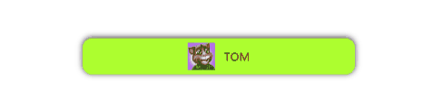
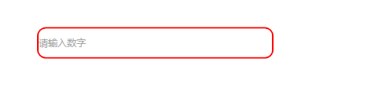
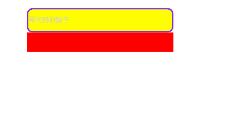
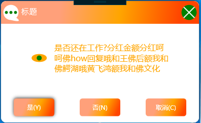

[](https://gitee.com/ChanceZXY/DesktopCustomControl)
# DesktopCustomControl

## 介绍
C#WPF自定义控件集，也支持WinFrom，项目基于.netFrameWork4.6.1,完全原生开发，没有使用任何第三方控件，可以直接用在你的项目中，该项目会一直更新，后面会移植到.net Core 3.1上.
***

**如果我的代码对您有帮助，请给厨子一个星星,谢谢，您的赞赏是我最大的动力**
***
## 使用方法
- 在WPF中使用方法：
```XAML
xmlns:cus="clr-namespace:CustomControl.CustomComponent;assembly=CustomControl
```
- 你也可以直接调用库里面的样式
```
<Application.Resources>
    <ResourceDictionary>
        <ResourceDictionary.MergedDictionaries>
            <ResourceDictionary Source="pack://application:,,,/CustomControl;component/Resource/Dictionary/ControlDictionary.xaml"></ResourceDictionary>
        </ResourceDictionary.MergedDictionaries>
    </ResourceDictionary>
</Application.Resources>
如这样调用即可：
<Button Width="100" Height="40" Style="{DynamicResource button}"/>
```
- 在WinForm中使用方法：
项目中添加WPF用户控件，然后在xaml文件中引入以下即可
```XAML
xmlns:cus="clr-namespace:CustomControl.CustomComponent;assembly=CustomControl
```
**WPF项目和WinForm项目都需要引入CustomControl这个依赖库，并且把库文件放到项目生成文件夹下面即可，即与（.exe）程序同目录**
***

## 接下来展现每个控件的效果，您可以在此基础上进一步自定义和扩展，包含（control和view）

## A.Control(控件)介绍
***

### 1\. ImageButton （图片按钮控件）


可以这样使用得到上面的结果，以下写的属性是添加的依赖属性：
```xaml
示例代码
<cus:ImageButton Width="300" Height="40" 
                ImageWidth="30" ImageHeight="30" ImageButtonSource="tom.jpg" ImageVisibility="Visible"
                ImageButtonContent="TOM" Foreground="Red" CornerRadius="10" Background="GreenYellow" OverBackground="BlueViolet"/>
```
属性说明：
- ImageButtonSource 图片资源路径
- ImageButtonContent 内容
- ImageVisibility 图片是否可见
- ImageWidth/ImageHeight 长宽
- OverBackground 鼠标浮动背景色
- CornerRadius 圆角
***

### 2\. CustomTextControl （文本输入控件）

```xaml
示例代码
<cs:CustomTextControl Width="300" Height="40" 
CornerRadius="10" TextInputType="digitAndLetter" TextPlaceHolder="请输入"/>
```
```     
    /// <summary>
    /// 文本输入类型
    /// </summary>
    public enum TextInputType  
    {
        defaultText = 0,//普通文本(包括汉字)
        digit = 1, //仅实数
        letter = 2,  //仅字母
        digitOrLetterLine = 3, //数字、字母或下划线
        digitAndLetter = 4, //数字和字母(密码使用)
        chinese = 5,  //汉字
    }
```
属性说明：
- CornerRadius 圆角
- TextPlaceHolder占位符提示
- TextInputType 文本输入类型
***

### 3\. SwitchControl（开关控件）

```
示例代码
<cus:SwitchControl Width="100" Height="30" Foreground="Red" SwitchContent="关"
                    SwitchOpenBackground="BlueViolet" SwicthCloseBackground="YellowGreen"/>
```
属性说明：
- CornerRadius 圆角
- SwitchContent 内容
- SwitchOpenBackground  打开的背景颜色
- SwicthCloseBackground  关闭的背景颜色
***

### 4\. QRCodeControl（二维码控件）
这个控件需要在vs中下载一个QRCoder包就可以使用了


属性说明：
- CornerRadius 圆角
- QRCodeImage  二维码图片,这个不要设置
- QRCodeContent  二维码内容
- QRCodeIcon  二维码图标
- QrCodeIconSizePercent 图标百分比大小，建议小于20，大了无法扫码
- QrCodeIconBorderWidth 图标外边框厚度大小
- QrCodePixelsPerModule 二维码像素
- Foreground  二维码前置颜色
- Background  二维码背景色
***

### 5\.CustomComboBox (可编辑下拉控件)

```
示例代码
<cus:CustomComboBox Width="300" Height='40' ToolTip="下拉框"
                    CornerRadius="10" IsEditable="False"
                    ComboBoxListBackground="BlueViolet" 
                    ComboxBoxItemMouseOverBackground="Yellow"
                    ToggleButtonBackground="Green">
    <cus:CustomComboBoxItem Content="中国"></cus:CustomComboBoxItem>
    <cus:CustomComboBoxItem Content="UK"></cus:CustomComboBoxItem>
    <cus:CustomComboBoxItem Content="America"></cus:CustomComboBoxItem>
</cus:CustomComboBox>
```
- CornerRadius 圆角
- ComboBoxListBackground 下拉框背景颜色
- ComboxBoxItemMouseOverBackground 鼠标悬浮时背景颜色
- ToggleButtonBackground 按钮框填充色
***

### 6\. MutilComboBoxControl （多选可编辑下拉控件）
继承CustomComboBox ，支持checkbox、button、image，可来回切换，并增加相应事件


```
示例代码
<cus:MutilComboBoxControl Width="300" Height='40' x:Name="mcb" ItemsSource="{Binding list}" 
                            ItemType="Button" ItemButtonContent="删除" 
                            DeleteItemValue="mcb_DeleteItemValue"
                            ClearButtonIsCheckedChanged="mcb_DeleteButtonIsCheckedChanged" 
                            IsEditable="False" AddDeleteFun="True" ItemImageSource="tom.jpg"
                            cus:MutilComboBoxControl.SelectedType="OnlyCheckBox"/>

    //选择类型
    public enum SelectedType
    {
        OnlyCheckBox = 1, //仅CheckBox
        MutilItem = 2     //整个子项
    }
    //内容类型
    public enum ItemType
    {
        CheckBox = 1, //文本+选择框
        Button = 2, //文本+按钮
        Image = 3, //文本+图片
    }
```
- SelectedItemContent 选择项文本内容
- ItemType  选择子项类型（ItemType）
- ItemButtonContent ItemType=Button时设置button的内容
- DeleteItemValue ItemType=Button时触发的事件
- ItemImageSource ItemType=Image时图片路径
- StrokeLineColor 删除X符号的颜色
- AddDeleteFun 是否添加删除按钮
- ClearButtonIsCheckedChanged 清空文本时触发的事件（暂时还没添加功能有需要再加）
- SelectedType 表示只有Checked点击有效，否则表示整个子项点击有效
***

### 7\. CustomPasswordBox（可清除、铭文显示密码框）
支持删除、明码、Icon选择



```
<cus:CustomPasswordBox x:Name="cpb" Width="300" Height="50" BorderThickness="3" IconSizePercent="1" Background="Yellow" Foreground="Green" IsEyeVisible="True"/>
```
- IsEyeVisible 眼睛和锁图标是否可见
- IconSizePercent 图标百分比大小
- PasswordChar 加密符号
- MaxLength
- PasswordPlaceHolder 占位符
- CornerRadius 圆角
- OnPasswordValueChanged 密码Changed事件

### 8\. CustomIconControl（图标控件）
纯代码绘制图标，目前只画了15个，后面有需要再加


```
<cus:CustomIconControl x:Name="xxx" Width="50" Height="30" Kind="Eye" Foreground="Green" Background="Yellow" IconSizePercent="10"/>
```
- Kind 图标类型 
- IconSizePercent 图标百分比大小
***

### 9\. CustomProgressBar（进度控件）
继承ProgressBar，可支持文字、竖直和横向


```
<cus:CustomProgressBar x:Name="progress" Width="300" Height="40" CornerRadius="10" IsIndeterminate="False"  Orientation="Horizontal" Background="SaddleBrown" Foreground="Red" Value="0" TextColor="Blue"/>
```
- TextColro 文本颜色
- CornerRadius 圆角
***

### 10\. CustomSlider (滑动控件)
继承Slider，可支持文字、竖直和横向


```
<cus:CustomSlider x:Name="slider" Width="300" Height="300" CornerRadius="10" Background="Yellow" 
                    Foreground="SaddleBrown" ShapeType="Circle" Maximum="100" Minimum="0"
                    SliderBackground="Red" SliderTextShow="True" 
                    ThumbBrush="BlueViolet" ThumbSize="40" Orientation="Vertical" 
                    SliderWidth="20" SliderHeight="20"/>
```
- SliderWidth  用于纵向
- SliderHeight  用于横向
- SliderBackground  Slider背景
- ShapeType  Thumb形状类型(Rectangle,Ellipse,Circle)
- ThumbBrush  Thumb填充颜色
- ThumbSize   thumb大小
- SliderTextShow  Value是否显示
- CornerRadius 圆角
***
### 11\. CustomPopupEx （浮动控件）
可随父本控件移动，有阴影效果


```
<cus:CustomPopupEx IsOpen="True" StaysOpen="True" Placement="Center" 
PlacementTarget="{Binding RelativeSource={RelativeSource Mode=TemplatedParent}}" 
Width="300" Height="300" IsPositionUpdate="True" Topmost="True">
    <Grid Background="Red"/>
</cus:CustomPopupEx>
```

- IsPositionUpdate 是否跟随父控件移动
- Topmost 是否置前
***


## B.视图(View)介绍
***
### 1\. MessageDialog （弹出框）
继承MessageBox，可提供自定义修改,支持键盘控制



调用方法：目前有2个方法
```
MessageDialog.Show("标题", "是否还在工作?分红金额分红呵呵佛how回复哦和王佛后额我和佛鳄湖哦黄飞鸿额我和佛文化", IconType.Eye);
```
***

### 2\. MediaPlayerView（视频播放器）
基于MediaElement，自定义视频播放器,
有上一集，暂停，播放，下一集，倍速，音量控制，全屏，下载(待完成)等功能


- Source 资源路径
- ItemSource 资源路径集合
***